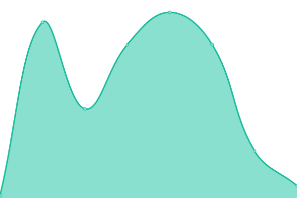
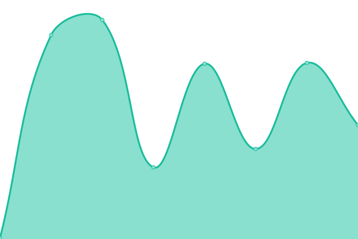

# [📈 Live Status](https://jessgusclark.github.io/psr-upptime): <!--live status--> **🟧 Partial outage**

This repository contains the open-source uptime monitor and status page for [Jesse Clark](https://DeveloperJesse.com), powered by [Upptime](https://github.com/upptime/upptime).

With [Upptime](https://upptime.js.org), you can get your own unlimited and free uptime monitor and status page, powered entirely by a GitHub repository. We use [Issues](https://github.com/jessgusclark/psr-upptime/issues) as incident reports, [Actions](https://github.com/jessgusclark/psr-upptime/actions) as uptime monitors, and [Pages](https://jessgusclark.github.io/psr-upptime) for the status page.

<!--start: status pages-->
<!-- This summary is generated by Upptime (https://github.com/upptime/upptime) -->
<!-- Do not edit this manually, your changes will be overwritten -->
<!-- prettier-ignore -->
| URL | Status | History | Response Time | Uptime |
| --- | ------ | ------- | ------------- | ------ |
|  [Live Public Site](https://practicesightreading.com) | 🟩 Up | [live-public-site.yml](https://github.com/jessgusclark/psr-upptime/commits/HEAD/history/live-public-site.yml) | 

 180ms
     
 | 

<a href="https://status.practicesightreading.com/history/live-public-site">100.00%</a>
    

|  Music Builder Health Endpoint | 🟥 Down | [music-builder-health-endpoint.yml](https://github.com/jessgusclark/psr-upptime/commits/HEAD/history/music-builder-health-endpoint.yml) | 

 0ms
     
 | 

<a href="https://status.practicesightreading.com/history/music-builder-health-endpoint">0.00%</a>
    

|  Request music from Music Builder | 🟥 Down | [request-music-from-music-builder.yml](https://github.com/jessgusclark/psr-upptime/commits/HEAD/history/request-music-from-music-builder.yml) | 

 0ms
     
 | 

<a href="https://status.practicesightreading.com/history/request-music-from-music-builder">0.00%</a>
    

|  Staging Server | 🟩 Up | [staging-server.yml](https://github.com/jessgusclark/psr-upptime/commits/HEAD/history/staging-server.yml) | 

 227ms
     
 | 

<a href="https://status.practicesightreading.com/history/staging-server">100.00%</a>
    

|  [Image Server](https://i.practicesightreading.com/) | 🟥 Down | [image-server.yml](https://github.com/jessgusclark/psr-upptime/commits/HEAD/history/image-server.yml) | 

 0ms
     
 | 

<a href="https://status.practicesightreading.com/history/image-server">0.00%</a>
    

<!--end: status pages-->

[**Visit our status website →**](https://jessgusclark.github.io/psr-upptime)

## 📄 License

- Powered by: [Upptime](https://github.com/upptime/upptime)
- Code: [MIT](./LICENSE) © [Jesse Clark](https://DeveloperJesse.com)
- Data in the `./history` directory: [Open Database License](https://opendatacommons.org/licenses/odbl/1-0/)
